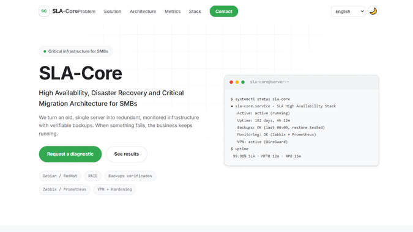
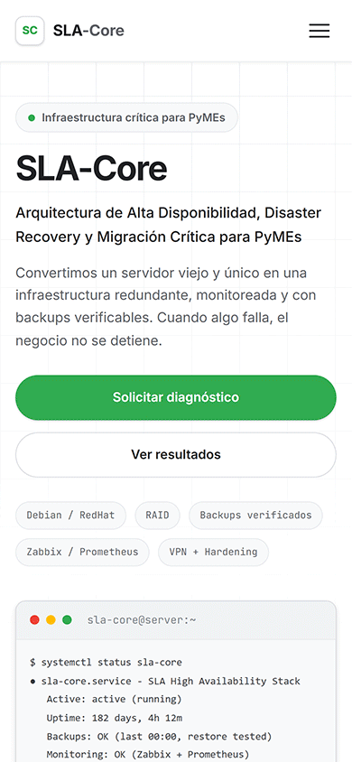

# SLA-Core

**SLA-Core** es un framework de alta disponibilidad, recuperación ante desastres (Disaster Recovery) y modernización de infraestructura para entornos Linux empresariales. Diseñado específicamente para administradores de sistemas, consultores TI y líderes técnicos a cargo de cargas de trabajo críticas en PyMEs, *SLA-Core* elimina los puntos únicos de falla (SPOF) y reemplaza esquemas manuales precarios por operaciones automatizadas, resilientes y probadas en producción.

Con un motor automatizado de copias de seguridad, rutinas de hardening perimetral, aislamiento de servicios en contenedores y telemetría continua, el proyecto transforma servidores monolíticos vulnerables en infraestructuras de alta disponibilidad, garantizando continuidad de negocio y ventanas de recuperación medibles (RPO/RTO).

### 📸 Capturas de pantalla

<div align="center">
  <table border="0">
    <thead>
      <tr>
        <th align="center">Versión de PC</th>
        <th align="center">Versión Móvil</th>
      </tr>
    </thead>
    <tbody>
      <tr>
        <td align="center" valign="middle">
          
        </td>
        <td align="center" valign="middle">
          
        </td>
      </tr>
    </tbody>
  </table>
</div>

## ✨ Características Principales

* **Almacenamiento Zero-SPOF:** Redundancia de almacenamiento mediante RAID 1 por software (`mdadm`) o esquemas ZFS espejo, previniendo caídas totales de servicio por falla física de discos.

* **Motor Automatizado de Backups Multi-Destino:** Script orquestador robusto en Bash con compresión Zstandard (`zstd`), políticas locales de retención, firmas criptográficas SHA-256 y sincronización remota cifrada (`rsync`).

* **Verificación Auditada de Disaster Recovery (DR):** Herramienta dedicada de validación no destructiva (`test_restore.sh`) que verifica la integridad del archivo y el flujo de restauración de bases de datos antes de que ocurra una contingencia real.

* **Hardening Perimetral y Optimización de Kernel:** Script de seguridad base con directivas estrictas de red a nivel de kernel vía `sysctl`, deshabilitación de acceso directo a root por SSH, parches automáticos de seguridad (`unattended-upgrades`) y mitigación de intrusiones mediante `fail2ban`.

* **Túnel de Administración Cifrado:** Configuración de VPN WireGuard dedicada que aísla los puertos de administración técnica (SSH, bases de datos, métricas) fuera del alcance de la red pública.

* **Telemetría Integral y Alertas Proactivas:** Pila preconfigurada de Prometheus y Node Exporter que monitoriza el rendimiento del host, saturación de disco, consumo de memoria y estado de servicios con umbrales de alerta predefinidos.

## ⚙️ ¿Qué Hace? (Módulos Disponibles)

Desde el despliegue inicial hasta la operación continua, *SLA-Core* implementa los siguientes componentes:

1. **Hardening de Sistema y Defensa Perimetral (`scripts/system_hardening.sh`):** Configura protecciones TCP/IP en el kernel, revoca autenticación SSH por contraseña, activa cortafuegos UFW y levanta jaulas de protección con Fail2ban.

2. **Motor Automatizado de Backups (`scripts/backup_engine.sh`):** Exporta bases de datos en caliente, empaqueta volúmenes Docker, comprime mediante `zstd`, genera manifiestos de integridad SHA-256, sincroniza a un servidor externo y purga copias antiguas.

3. **Prueba de Integridad de Disaster Recovery (`scripts/test_restore.sh`):** Evalúa carpetas de respaldo contra sus firmas criptográficas y valida la descompresión sin alterar las operaciones en ejecución.

4. **Recolección de Métricas y Monitoreo (`docker-compose.yml` y `prometheus/`):** Despliega Prometheus y Node Exporter en contenedores con reglas de alerta listas para detectar saturación de almacenamiento, picos de memoria RAM o caída de nodos.

5. **Acceso Remoto Seguro (`wireguard/wg0.conf`):** Canaliza todo el tráfico administrativo dentro de una red privada virtual punto a punto autenticada mediante llaves asimétricas.

## 🛠️ Tecnologías Utilizadas

* **Sistemas Operativos:** Debian GNU/Linux 12 (Bookworm) / Red Hat Enterprise Linux 9 (RHEL).

* **Contenedores:** Docker y Docker Compose v2.

* **Automatización y Scripts:** Bash (estándar `set -Eeuo pipefail`), GNU Coreutils, `zstd`.

* **Monitoreo y Métricas:** Prometheus TSDB y Node Exporter.

* **Seguridad y Redes:** WireGuard VPN, UFW / iptables, Fail2ban, OpenSSH.

## 🚀 Instalación y Uso

1. Clonar el repositorio en el servidor destino:
   ```bash
   git clone [https://github.com/yurialexanderpagelkruger/sla-core-infrastructure.git](https://github.com/yurialexanderpagelkruger/sla-core-infrastructure.git)
   cd sla-core-infrastructure

## 👨‍💻 Autor

Desarrollado por **Yuri Alexander Pagel Krüger**
